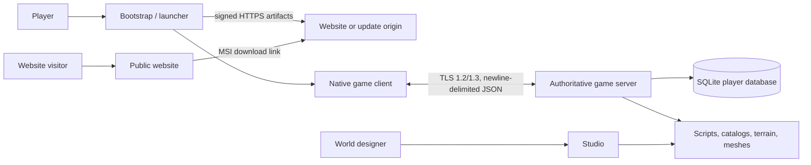

# World of Ato — Engineering Manifest

> **Primary portfolio artifact.** Architecture and implementation snapshot for
> World of Ato. Implemented behavior, migration/reference paths, and future
> recommendations are kept distinct so this document can serve as credible
> technical evidence for engineering review.

This manifest represents end-to-end work across runtime architecture,
authoritative multiplayer systems, native graphics and UI, persistence,
content tooling, security, release engineering, and operations. It is written
for a technical reviewer who wants to understand not only what technologies
are present, but why the boundaries exist and what remains to be improved.

## 1. System summary

World of Ato is a Windows-native multiplayer RPG with a custom engine, an
authoritative game server, a native player client, a content-authoring Studio,
a public website, and a two-stage self-update system. The stack is primarily
.NET 10 and C#, with TypeScript/React used by the website and current Studio
interface.

The deployed game is not a browser frontend over a REST API. It is a realtime
desktop client communicating directly with a stateful simulation server over
TLS/TCP. The website is a separate acquisition and community surface; it does
not participate in authentication, gameplay, or player persistence.

## 2. Current stack

| Layer | Current implementation | Primary responsibility |
| --- | --- | --- |
| Player application | .NET 10, SDL3, Direct3D 11, NoesisGUI | Input, presentation, local preferences, network session |
| Shared engine | Dependency-light .NET 10 class library | World model, assets, scripting, terrain, physics, protocol DTOs |
| Game server | .NET 10 console service | Authoritative simulation, accounts, gameplay, persistence |
| Database | Embedded SQLite | Accounts, player state, quests, inventory, bank, clans |
| Studio | WPF host, WebView2, React/TypeScript, shared engine | World and content authoring |
| Launcher/update chain | Avalonia 12.1, signed ZIP artifacts | Bootstrap, patch, validate, and launch the player client |
| Installer | WiX Toolset project | Windows MSI packaging |
| Public website | vinext, Next 16, React 19, TypeScript, Cloudflare Worker | Marketing and installer download |

## 3. System context and boundaries

The major runtime relationships are:



There are two deliberately independent delivery planes:

- the game plane is a long-lived TLS/TCP connection on port `27477` by
  default;
- the distribution plane serves the MSI and signed update artifacts over
  HTTPS. A built-in update listener on `27478` exists for controlled
  development or explicitly configured hosting, but loopback-only HTTP is the
  safe development default.

The website does not directly access the game database or simulation process.

## 4. Repository and project boundaries

`WorldOfAto.Runtime.slnf` is the canonical shipping solution filter. It
includes:

- `WorldOfAto.Engine` — platform-neutral engine and shared protocol contracts;
- `WorldOfAto.Graphics.Direct3D11` — production GPU renderer;
- `WorldOfAto.UI` — UI contracts, design-system tokens, component catalog, and
  presentation-independent state;
- `WorldOfAto.UI.Noesis` — production Noesis XAML implementation;
- `WorldOfAto.Client.Native` — shipping SDL3 player executable;
- `WorldOfAto.Server` — authoritative server; and
- `WorldOfAto.UI.Validation` — architecture and production-UI validation.

The solution also contains historical or non-player surfaces. `WorldOfAto.Client`,
`WorldOfAto.Client.Modern`, `WorldOfAto.Port`, and `WorldOfAto.Windows` retain
previous WinForms, WebView, OpenGL, or compatibility work. Studio projects are
authoring surfaces, `client-ui` is migration/reference UI, `studio-ui` is an
active embedded authoring interface, and `website` is an independently built
web application.

This distinction matters because several projects produce executables with
similar names. The root scripts and runtime solution filter define the intended
shipping path.

## 5. Shared engine

`WorldOfAto.Engine` is the domain center of the runtime. It avoids presentation
framework dependencies so client, server, Studio, validation tools, and
headless paths can share behavior and contracts.

Its responsibilities include:

- world and entity models: scenes, entities, transforms, cameras, colors,
  meshes, and materials;
- simulation: animation, timers, character and collision systems,
  environment state, and procedural grass;
- asset loading for `.atomesh`, `.atomat`, `.atoanim`, `.atoterrain`, `.atomap`,
  `.atoitems`, and `.atojson` families plus ordinary textures and audio;
- terrain: bounded heightfields, chunking, LOD, biomes, material evaluation,
  holes, splines, water, decals, and authoring operations;
- AtoScript lexer, parser, AST, compiler, runtime, values, and game bindings;
- shared network contracts, framing, DTOs, JSON settings, TLS helpers, and
  snapshot application; and
- software fallback rendering for validation and non-production paths.

The server advances the authoritative instance. The client constructs a
presentation-side world from snapshots and does not run a second authoritative
gameplay simulation.

## 6. Authoritative server

`WorldOfAto.Server` is a stateful .NET process built around `AtoServer`. Its
default startup inputs are:

| Setting | Default |
| --- | --- |
| Bind address | `127.0.0.1` |
| Game port | `27477` |
| Update port | `27478` |
| Simulation tick | 30 Hz |
| World script | `assets/scripts/world.ato` |
| Data directory | `data` |
| Database | `data/world-of-ato.db` |

At startup the server loads its TLS identity, AtoScript world, content and
item catalogs, backend repositories, permission assignments, badge definitions,
dialogue data, and commerce data. It starts an accept loop and a fixed-cadence
simulation loop.

Each connection completes TLS and protocol authentication before becoming a
client session. During each tick the server reads accepted input, advances
server-owned player controllers and the shared engine, streams terrain around
authenticated players, creates a client-specific snapshot, culls entities
outside the interest radius, and sends the result to that client.

Chat, clans, dialogue, UI, commerce, and other service actions use typed paths
outside the movement snapshot loop. The client requests a mutation; backend
services on the server validate and execute it. The process is currently
monolithic, keeping deployment simple but making future scale-out an explicit
partitioning or sharding problem.

Important server modules include:

- `AtoBackend` for online profiles, progression, quests, inventories, and
  catalog resolution;
- `AtoPlayerRepository` for SQLite schema migration and transactional
  persistence;
- `QuestCatalog`, `DialogueService`, and `CommerceService` for content and
  service flows;
- `PermissionService`, `BadgeService`, and `AuditService` for authorization,
  display metadata, and privileged-action records; and
- `LanUpdateServer` for explicitly enabled local update hosting.

## 7. Network protocol

The shared protocol is version `3`. Transport is TLS 1.2/1.3 over .NET
sockets. Application frames are newline-delimited JSON envelopes:

```json
{
  "type": "client_input",
  "payload": {
    "sequence": 42,
    "moveForward": true,
    "lookDeltaX": 0.012
  }
}
```

Deserialization is case-insensitive but rejects unmapped members, caps JSON
depth at 64, and uses bounded line readers. Client frames are limited to 16 KiB;
server frames can be up to 8 MiB because snapshots may contain entity and
dynamic-mesh data.

The connection sequence is:

1. native client connects and completes TLS;
2. client sends a versioned hello with account credentials or registration;
3. server authenticates against SQLite;
4. server sends authentication, welcome, and initial player/clan state; and
5. the client sends input or typed actions while the server sends snapshots and
   service responses.

Input and chat carry monotonic sequence numbers. The client keeps at most one
in-flight input send task, preventing a slow connection from creating an
unbounded local queue. The server tracks known dynamic meshes per session so
terrain data is not resent in every snapshot. Schema changes must be
coordinated with `NetworkProtocol.Version` and compatible client/server
releases.

## 8. Native player client

The shipping client is `WorldOfAto.Client.Native`, a .NET 10 Windows executable
with SDL3 as its platform and input layer.

Its startup lifecycle is:

1. SDL creates the native window and event loop;
2. the Direct3D 11 renderer selects a high-performance adapter and owns the
   device, immediate context, and flip-discard swap chain;
3. NoesisGUI binds to that same D3D11 context;
4. assets load asynchronously while a native loading presentation renders;
5. login or registration establishes the TLS protocol session; and
6. the frame loop pumps SDL events, routes UI input before gameplay input,
   consumes the newest server state, renders the scene, composites UI after
   tone mapping, and presents the frame.

The player UI has three layers:

- `WorldOfAto.UI` defines owned tokens, components, commands, messages, and
  presentation contracts;
- `WorldOfAto.UI.Noesis` implements the production XAML document, providers,
  thread guards, focus routing, and D3D11 integration; and
- the native client binds network state and SDL events to
  `AtoUiPresentationModel`.

The MVVM-driven surface includes login, loading, channel-aware chat, inventory,
skills, quest journal and tracking, clans, dialogue, commerce, options, HUD
telemetry, and the Escape menu. UI receives keyboard, Unicode text, pointer,
wheel, touch, focus, and gamepad events first; only unhandled input reaches
movement and camera controls. Local graphics, window, gamepad, and credential
preferences remain client-side, while progression and world mutations remain
server-side.

## 9. Rendering

The production renderer is `WorldOfAto.Graphics.Direct3D11`, built on Vortice
bindings. Its current pipeline includes:

- a linear HDR scene target and ACES-fitted filmic output;
- procedural atmosphere and quality-scaled volumetric clouds;
- four stable cascaded directional shadow maps with PCSS-style filtering;
- Cook-Torrance GGX material lighting and weather-aware skylight;
- altitude-aware fog and aerial perspective;
- tessellated, wave-displaced water;
- scalable screen-space ambient occlusion, bloom, and histogram-based
  automatic exposure; and
- post-tone-map UI composition.

Renderer settings can be represented in server snapshots and are also exposed
through persisted client graphics controls. Debug views and deterministic frame
capture support visual diagnosis. Software and older OpenGL renderers remain
compatibility/reference paths and do not define shipping visual correctness.

## 10. Persistence and data ownership

SQLite is the authoritative store for account and player state. The repository
manages schema migration, foreign keys, WAL mode, transactional profile saves,
and clan mutations.

Principal data includes accounts, players, skills, inventory, bank slots,
equipment, quests, tracked quests, hotbars, namespaced player flags, clans,
members, invites, events, and migration/import bookkeeping. Legacy JSON player
profiles are imported once and retained as backups.

| Data | Owner | Persistence |
| --- | --- | --- |
| Accounts, position, progression, inventory, quests, clans | Game server | SQLite |
| World definitions, items, NPCs, quests, terrain, materials | Repository/release assets | Versioned files |
| Active movement/input | Game server session | Memory only |
| Graphics and device preferences | Native client | Local preferences |
| Website content | Website source/build | Static/server-rendered deployment |

Session-only state, including active shop/bank interaction and running state,
is reset at login and is not accepted from storage as authoritative gameplay
state.

## 11. Content and scripting pipeline

Game content is data-first. The server and client load versioned assets rather
than embedding world definitions into UI code.

- `assets/scripts/world.ato` is the default server boot script;
- `assets/content/items.atoitems` is the item catalog;
- `assets/content/catalogs` contains shops, quests, NPCs, monsters, and
  dialogues;
- `assets/maps` stores editable Studio maps;
- `assets/terrain` stores bounded authored heightfields and metadata; and
- meshes, materials, and animations live in their respective asset families.

AtoScript uses a lexer → parser/AST → compiler/runtime → game-bindings
pipeline. Scripts can construct and update entities, configure environment and
rendering state, load terrain and content, register interactions, and define
replicated UI objects. Because scripts execute on the authoritative server,
filesystem resolution and asset sizes are bounded and paths are constrained
below the asset root.

Custom formats provide control over runtime behavior, but also make validators,
versioning, import tools, and backward compatibility core platform
responsibilities.

## 12. Studio authoring stack

The current Studio entry point builds `WorldOfAto.Studio.Modern`:

- WPF owns the desktop window and native host lifecycle;
- WebView2 renders the bundled Studio React application;
- host and UI communicate through JSON web messages;
- C# performs filesystem operations, imports, validation, preview orchestration,
  and shared-engine manipulation; and
- Vite builds the TypeScript application into `dist`, which MSBuild copies into
  Studio output.

Studio authors scenes, nested object hierarchies, scripts, GUI trees, terrain,
materials, item catalogs, animations, audio, and environment settings. Maps are
stored as `.atomap`; saving the main map can regenerate the server’s
`world.ato` entry script.

Studio is intentionally isolated from the shipping player. WebView2 and React
are acceptable authoring dependencies but are rejected from the player payload
and recursive player dependency graph.

## 13. Public website

The `website` directory is a separate TypeScript application:

- vinext and Vite provide the Cloudflare-compatible build/runtime;
- Next, React, and TypeScript implement the pages;
- a Cloudflare Worker entry delegates App Router requests and image
  optimization to vinext; and
- Drizzle and D1 support are scaffolded but inactive.

The implemented routes are a marketing home page and `/download`. The download
page links to the World of Ato installer. There is no website account system,
gameplay API, admin surface, or integration with the SQLite game database in
the current source.

This separation means a public content-site compromise does not inherently
grant access to the game database or simulation process. Release integrity still
depends on correct HTTPS hosting and updater signature verification.

## 14. Security model

The server assumes the client is hostile. Implemented controls include:

- mandatory TLS 1.2/1.3 for game traffic;
- refusal to bind publicly without an explicit certificate and private key;
- optional SHA-256 certificate pinning in the client and updater;
- a 10-second transport/authentication deadline;
- global and per-address connection caps;
- bounded frames, strict JSON schemas, and a protocol-version gate;
- per-session and per-address rate limits;
- PBKDF2-HMAC-SHA-256 password hashes with unique salts and 600,000 iterations;
- fixed-time hash and pin comparisons;
- one live session per stable account ID;
- monotonic sequence checks and rejection of non-finite or excessive input;
- default-deny mutation permissions and loopback-only developer mode;
- stable account-ID staff authorization, parameterized SQL, and audit logging;
- serialized shared merchant-stock mutations; and
- signed update manifests, SHA-256 package checks, size/entry limits, and safe
  ZIP path validation.

Production secrets, certificates, update-signing keys, databases, audit logs,
and backups belong outside the repository under a dedicated unprivileged
service account. Only the game TLS endpoint and HTTPS distribution endpoint
should be exposed.

## 15. Release and update chain

The distribution chain has two update stages:

```text
World of Ato.exe
  -> verifies launcher-manifest.json and launcher.zip
  -> starts World of Ato Launcher.exe
     -> verifies manifest.json and client.zip
     -> installs a versioned client directory
     -> validates the game TLS endpoint
     -> starts client.exe
```

`Publish-LanUpdate.ps1` stages complete generations, verifies package contents,
hashes artifacts, optionally signs manifests with ECDSA, promotes packages
before manifests, and uses safe file/directory promotion helpers. The permanent
bootstrap updates the launcher independently so update logic can evolve without
manually replacing the bootstrap executable.

The WiX project under `installer` produces the MSI. Internet releases are
orchestrated by the PowerShell tools under `tools`.

## 16. Validation and operations

Canonical developer entry points are:

```powershell
.\server.bat
.\client.bat
.\studio.bat
```

The runtime validation path checks theme/component parity, XAML and resource
integrity, isolated Noesis document loading, D3D11/Noesis lifecycle rules,
recursive dependency exclusions, and legacy UI/framework rejection. Server
smoke modes cover simulation boot, backend/catalog integrity, items, skill
progression, permissions, and clan lifecycle. The native client supports
bounded frame smoke runs, controlled preview scenes, debug views, and
deterministic PNG capture.

Current observability is process- and file-oriented: client/server crash logs,
console diagnostics, privileged-action audit records, machine-readable smoke
exit codes, render debug modes, and frame capture. Production operations should
add service supervision, structured log collection, database backup/restore
drills, certificate-expiration alerts, disk and connection monitoring,
dependency scanning, and public-endpoint TLS checks.

## 17. Strengths and constraints

The architecture’s strengths are:

- a clear server authority boundary;
- shared contracts across engine, client, server, and tools;
- one intentional graphics device and UI path for the shipping client;
- bounded and validated content formats;
- defense-in-depth distribution using TLS, signatures, hashes, and safe archive
  extraction;
- runtime filters and validators that codify architecture rules; and
- separation among website, Studio, and player dependency graphs.

Known constraints include JSON snapshot bandwidth, one-process snapshot
broadcasting, SQLite and single-process scaling limits, large orchestration
classes, the ongoing cost of custom scripting and asset formats, incomplete
temporal rendering/reflection/local-light features, and local rather than
centralized telemetry. Historical projects and older documents can also mislead
contributors unless the runtime filter and root scripts remain prominent.

## 18. Recommended priorities

1. Keep the runtime solution filter, root scripts, and engineering documentation
   as the canonical entry points.
2. Add protocol compatibility tests for every message type and intentional
   version bumps.
3. Instrument snapshot size, serialization, latency, tick duration, sessions,
   authentication failures, and database transaction latency.
4. Split server orchestration into transport/session, simulation, replication,
   and gameplay-action coordinators without changing authority boundaries.
5. Add integration tests using an ephemeral data directory and a real TLS
   client/server handshake.
6. Establish SQLite online-backup and restore procedures before player data
   becomes valuable.
7. Add release CI that builds the runtime filter, runs UI/server/website
   validation, produces signed artifacts, and verifies the installed update
   chain in a clean Windows environment.
8. Measure protocol bandwidth and interest management before selecting binary
   encoding, compression, delta snapshots, or sharding.
9. Keep the website stateless until a concrete user-facing feature requires
   persistence; then use a separate web datastore/API and explicit account-link
   flow.

## 19. Orientation for a new engineer

Start with:

1. `README.md` for launch commands and runtime policy;
2. `WorldOfAto.Runtime.slnf` for the shipping dependency boundary;
3. `src/WorldOfAto.Engine/AtoEngine.cs` for simulation composition;
4. `src/WorldOfAto.Engine/Network/NetworkProtocol.cs` for the wire contract;
5. `src/WorldOfAto.Server/Program.cs` for server lifecycle and authority;
6. `src/WorldOfAto.Server/Backend/AtoPlayerRepository.cs` for persistence;
7. `src/WorldOfAto.Client.Native/Program.cs` for the player loop;
8. `src/WorldOfAto.Graphics.Direct3D11/Direct3DRenderer.cs` for rendering;
9. `src/WorldOfAto.UI.Noesis/AtoUiPresentationModel.cs` and
   `Views/AtoGameRoot.xaml` for player UI behavior;
10. `src/WorldOfAto.Studio.Modern/MainWindow.xaml.cs` and `src/studio-ui` for
    the authoring bridge; and
11. `tools/Publish-LanUpdate.ps1` for release packaging and promotion.

The governing mental model is: **Studio authors versioned assets; the server
loads those assets and owns the world; the native client sends intent and
renders replicated state; the launcher distributes validated client
generations; and the website remains a separate public surface.**
