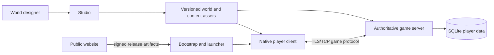

# World of Ato — Engineering Case Study

World of Ato is a Windows-native multiplayer RPG built as a complete game
runtime: an authoritative server, a native player client, a content-authoring
Studio, and a self-updating distribution pipeline.

This case study is about the engineering decisions that make those parts work
together.

## The product problem

World of Ato needs to support several kinds of work without allowing tooling
concerns to leak into the shipped game:

- players need a responsive native 3D client;
- the server must remain authoritative over movement, progression, inventory,
  quests, clans, and persistent state;
- designers need an editor for worlds, terrain, scripts, and content;
- releases need a repeatable bootstrap, launcher, validation, and update path;
- the public website must remain separate from gameplay and player data.

The central design goal is a clear boundary between authoring, simulation,
presentation, and distribution.

## System shape



The server owns gameplay outcomes and persistence. The client sends intent and
renders replicated state. Studio edits versioned assets; it is not part of the
player-client dependency graph. The website is a public distribution and
marketing surface, not a gameplay backend.

## Runtime architecture

The shipping runtime is primarily .NET 10 and C#:

| Surface | Responsibility |
| --- | --- |
| `WorldOfAto.Engine` | Shared world model, simulation primitives, assets, terrain, scripting, and protocol contracts |
| `WorldOfAto.Server` | Authoritative simulation, sessions, gameplay services, accounts, and persistence |
| `WorldOfAto.Client.Native` | SDL3 input, Direct3D 11 rendering, NoesisGUI presentation, and network session |
| `WorldOfAto.UI` / `WorldOfAto.UI.Noesis` | Owned player design system, MVVM state, XAML views, and UI integration |
| Studio | World and content authoring, validation, and preview |
| Bootstrap / launcher | Signed update verification, installation, and client launch |
| Website | Public pages and release-artifact distribution |

The authoritative server runs the simulation and writes player state to
SQLite. The client does not submit trusted gameplay results. Network messages
use a versioned, newline-delimited JSON protocol over TLS/TCP, with bounded
frames, sequence checks, rate limits, and explicit authentication.

## Key engineering decisions

### One authority for gameplay

Movement, progression, inventory, quests, clans, commerce, and other world
mutations are server-owned. The client requests actions; the server validates,
simulates, persists, and replicates the result.

### A shared engine with separate responsibilities

The engine shares domain types and behavior across client, server, Studio, and
validation paths without taking a dependency on a UI framework. Presentation
and authoring remain at the edges, while the server retains ownership of
simulation and persistence.

### A deliberate shipping client boundary

The player client uses SDL3, Direct3D 11, and NoesisGUI. It has one intentional
graphics device and one production UI path. Historical and authoring projects
may use different technologies, but they are not silently included in the
shipping player dependency graph.

### Data-first content

World scripts, item catalogs, quests, dialogues, NPCs, terrain, meshes,
materials, and animations are versioned assets. Custom formats and AtoScript
are validated and bounded at their loading boundaries.

### Update integrity as part of the product

The bootstrap updates the launcher, and the launcher updates the native game
client. Release generations are staged and validated before promotion; package
contents, hashes, signatures, archive paths, and endpoint configuration are
checked as part of the update flow.

## What this case study demonstrates

World of Ato’s main engineering challenge is integration: keeping a realtime
game, an editor, a persistent backend, a native renderer, and a safe release
pipeline aligned while each remains independently understandable.

The architecture favors explicit contracts and validation over implicit
coupling:

- the runtime solution filter defines the shipping boundary;
- the protocol version defines client/server compatibility;
- the server defines data ownership and gameplay authority;
- asset formats define the authoring-to-runtime contract; and
- release validators define what can be shipped.

## Verification and reproducibility

Use the World of Ato runtime solution and validation entry points from the
main project:

```powershell
$env:DOTNET_SYSTEM_GLOBALIZATION_USENLS = '1'
dotnet build .\WorldOfAto.Runtime.slnf -c Release
dotnet run --project .\src\WorldOfAto.UI.Validation -c Release
```

The validation path checks UI/resource integrity, production document loading,
renderer and UI lifecycle rules, recursive player dependencies, and prohibited
legacy dependencies. Server smoke modes cover simulation boot, catalogs, items,
progression, permissions, and clan lifecycle.

For the complete architecture snapshot, see
[`ENGINEERING_MANIFEST.md`](ENGINEERING_MANIFEST.md). It records the current
implementation, explicit migration boundaries, security model, operational
constraints, and recommended engineering priorities.

## License

This case-study documentation is released under the MIT License. World of Ato
artwork, code, and game assets remain the property of their respective rights
holders.
